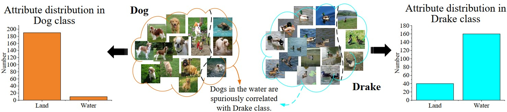
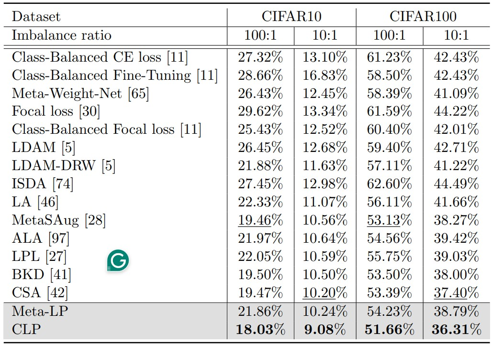
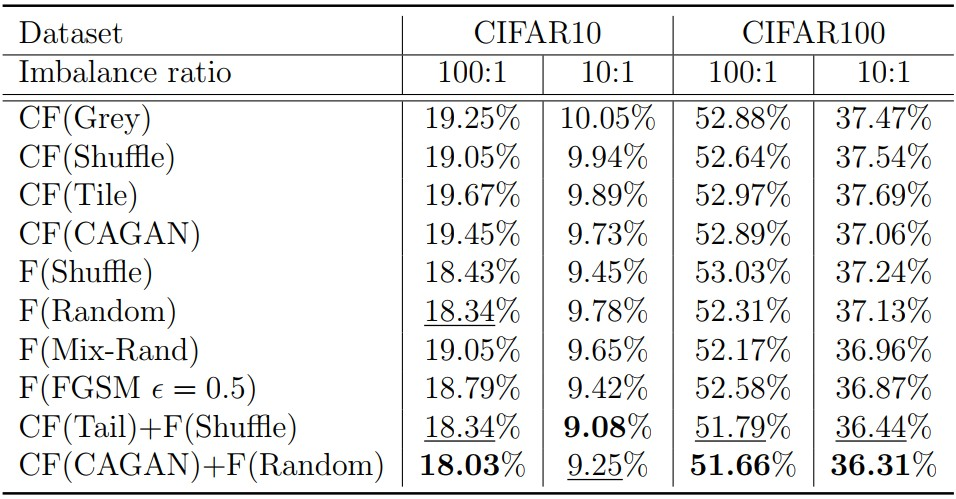
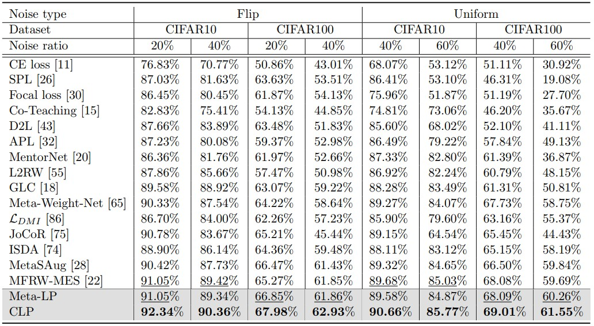
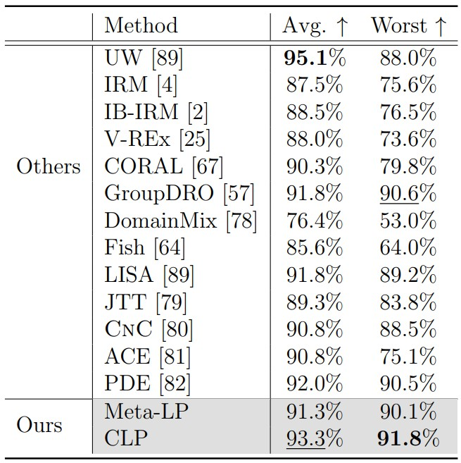
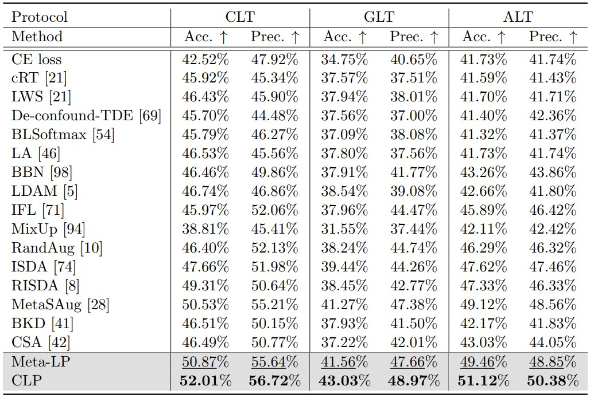
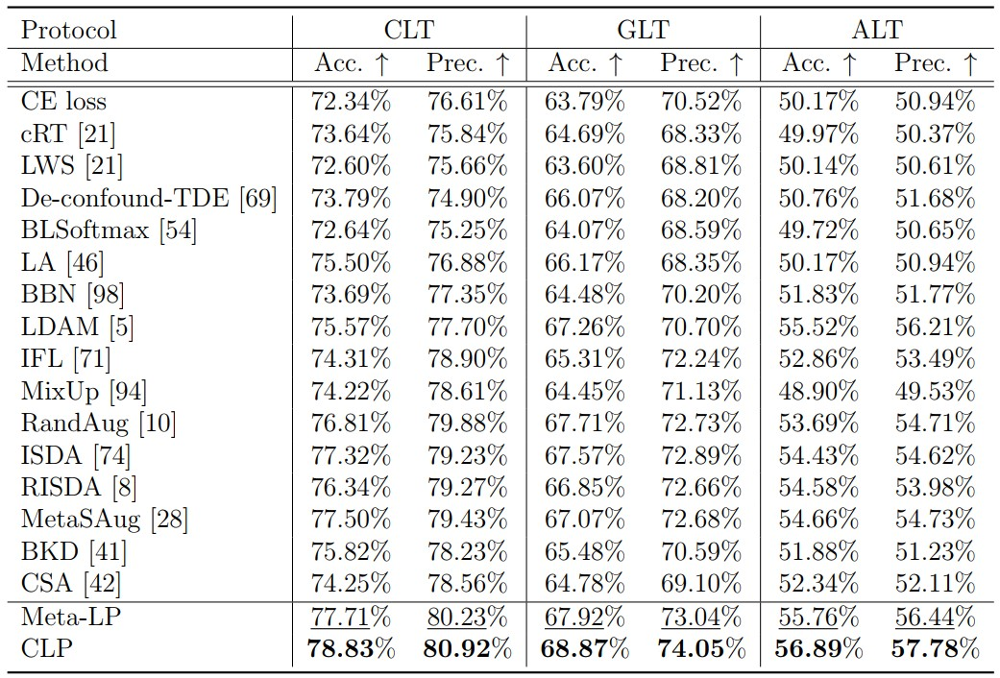

# Mitigating Spurious Correlations with Causal Logit Perturbation

 
This repository contains the code of "Mitigating Spurious Correlations with Causal Logit Perturbation".
 
## Abstract

Deep learning has seen widespread success in various domains such as science, industry, and society. However, it is acknowledged that certain approaches suffer from non-robustness, relying on spurious correlations for predictions. Addressing these limitations is of paramount importance, necessitating the development of methods that can disentangle spurious correlations. This study attempts to implement causal models via logit perturbations and introduces a novel Causal Logit Perturbation (CLP) framework to train classifiers with generated causal logit perturbations for individual samples, thereby mitigating the spurious associations between non-causal attributes (i.e., image backgrounds) and classes. Our framework employs a perturbation network to generate sample-wise logit perturbations using a series of training characteristics of samples as inputs. The whole framework is optimized by an online meta-learning-based learning algorithm and leverages human causal knowledge by augmenting metadata in both counterfactual and factual manners. Empirical evaluations on four typical biased learning scenarios, including long-tail learning, noisy label learning, generalized long-tail learning, and subpopulation shift learning, demonstrate that CLP consistently achieves state-of-the-art performance. Moreover, visualization results support the effectiveness of the generated causal perturbations in redirecting model attention towards causal image attributes and dismantling spurious associations.

<p align="center">
  
</p>

## Framework
The overall structure of CLP, which consists of four main components: the metadata augmentation module, the backbone classifier, the training characteristics module, and the perturbation network which generates sample-wise logit perturbations. The red and green lines indicate the learning loops of the backbone classifier and the perturbation network, respectively.

<p align="center">
  
</p>

## Requirements

- PyTorch >= 1.2.0
- Python3
- torchvision
- PIL
- argparse
- numpy


## Getting started

### Dataset

For long-tailed and noisy cifar data, the generation steps follow those in [Meta-Weight-Net](https://proceedings.neurips.cc/paper_files/paper/2019/file/e58cc5ca94270acaceed13bc82dfedf7-Paper.pdf).
- Long-tailed CIFAR10/100: The long-tailed version of CIFAR10/100. Detailed generation process can be seen in "./data/cifar/CIFAR_process.py".
- Noisy CIFAR10/100: The noisy version of CIFAR10/100. Detailed generation process can be seen in "./data/cifar/CIFAR_process.py".

For generalized long-tail benchmark, including ImageNet-GLT and MSCOCO-GLT, the generation steps follow those in [IFL](https://www.ecva.net/papers/eccv_2022/papers_ECCV/papers/136840698.pdf)
- ImageNet-GLT: The generalized long-tail version of ImageNet. Detailed generation process can be seen in "./data/GLT/_ImageNetGeneration".
- MSCOCO-GLT: The generalized long-tail version of MSCOCO. Detailed generation process can be seen in "./data/GLT/_COCOGeneration".

For the subpopulation shift benchmark, the acquisition process follows that of [chang et al.](https://openaccess.thecvf.com/content/CVPR2021/papers/Chang_Towards_Robust_Classification_Model_by_Counterfactual_and_Invariant_Data_Generation_CVPR_2021_paper.pdf)
- Waterbirds: Detailed processing steps can be seen in "./data/subpopulation/waterbirds_datasets.py".

### Train

We give training examples using cifar data:

Training on CIFAR-LT-10/100:
```
CIFAR100-LT, 
python CLP_train.py --imb_factor 10 --dataset cifar100 --num_classes 100
```
- The lambda value that guides the strength of the saliency regularization term can be changed in Line 44 of ``CLP_train.py".
- The infilling manner for the causal (foreground) and non-causal (background) components of images can be changed in Lines 55-56 of ``CLP_train.py". 
- The volume of metadata can be changed in Line 38 of ``CLP_train.py".


Or run the script:

```
sh train.sh
```

Training on Noisy CIFAR10/100 with flip noise:
```
Noisy CIFAR100, 
python CLP_train.py --corruption_type flip2 --corruption_ratio 0.2 --dataset cifar100 --num_classes 100
```

Or run the script:

```
sh train-noise.sh
```

### Test
```
python test.py
```

## Experimental results

For long-tail learning tasks:

<p align="center">
  
</p>
<p align="center">
  
</p>

For noisy learning tasks:

<p align="center">
  
</p>

For subpopulation shift tasks:

<p align="center">
  
</p>

For generalized long-tail learning tasks:

<p align="center">
  
</p>
<p align="center">
  
</p>

For more results, please refer to our paper. 